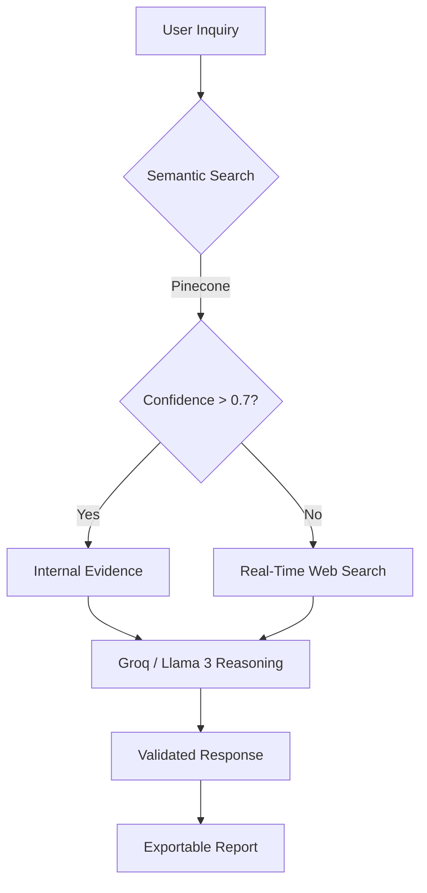

# 🌸 Bloom Health: Evidence-to-Impact

Bloom Health AI is a specialized platform designed to provide validated maternal health guidelines and policy information, specifically focusing on the Texas Maternal Health Plan. It leverages a Retrieval-Augmented Generation (RAG) architecture to ensure responses are grounded in official documentation.

## 🚀 The Bloom-ai-stack Process

The core process follows an "Evidence-First" approach:



### 🧠 `ask_bloom_ai` Detailed Logic
1.  **User Inquiry**: User asks a question via the Streamlit chat input.
2.  **RAG / Pinecone Semantic Search**: 
    - The question is embedded using **Google Gemini**.
    - **Pinecone** performs a vector search on the "evidence-to-impact" index to find the 3 most relevant context chunks.
3.  **Validation & Fallback**:
    - If the top match score is > 0.7, the system uses internal evidence from Texas state reports and guidelines.
    - If confidence is low, the system falls back to **Tavily API** for real-time web verification.
4.  **LLM Reasoning (Groq / Llama)**:
    - The retrieved context and the original question are sent to **Groq**, powering the **Llama 3.3 70B** model.
    - A specialized "Maternal Health Expert" persona is applied to ensure professional and accurate communication.
5.  **Multi-LLM Elasticity**:
    - The stack is designed for multi-provider support. While **Groq/Llama** provides high-speed reasoning, the system can be configured to use **OpenAI (GPT-4o)** for complex summaries or secondary verification.
6.  **Validated Response**: The AI response is streamed to the user with specific validation tags and source citations.

## ⚙️ Data Processing Pipeline

### 📥 Ingestion (`ingest_to_pinecone.py`)
- **Extraction**: Text is extracted from official reports and guidelines.
- **Chunking**: Documents are split into meaningful paragraphs to preserve context.
- **Embedding**: Each chunk is transformed into a 1536-dimensional vector using **Google Gemini (gemini-embedding-001)**.
- **Storage**: Chunks and their vectors are stored in a **Pinecone** index (`evidence-to-impact`) with source metadata.

### 🔍 Retrieval & Retrieval-Augmented Generation (`query_pinecone.py`)
- **Query Embedding**: The user's question is embedded using **Google Gemini (gemini-embedding-001)**.
- **Vector Matching**: Pinecone's vector search identifies the most relevant evidence chunks.
- **Fallback Mechanism**: When internal data is insufficient, **Tavily API** provides a secondary layer of real-time web-based evidence.

## 🏗️ Core Components & Interactions

| Component | Responsibility | Technology |
| :--- | :--- | :--- |
| **Frontend UI** | User interaction & Chat Interface | [Streamlit](https://streamlit.io/) |
| **Vector Database**| Long-term memory & semantic search | [Pinecone](https://www.pinecone.io/) |
| **Embeddings** | Converting text to mathematical vectors | [Google Gemini API](https://ai.google.dev/) |
| **Reasoning Engine**| Generating human-like expert responses | [Groq](https://groq.com/) (Llama 3.3 70B) |
| **Web Research** | Real-time external data verification | [Tavily](https://tavily.com/) |
| **Reporting** | Generating exportable `.docx` reports | [Python-docx](https://python-docx.readthedocs.io/) |

## 💰 Cost & API Economics

The Bloom-ai-stack is optimized for developer cost-efficiency, utilizing generous free tiers for initial development and cost-effective pay-as-you-go pricing for production.

### Estimated Pricing Table (as of 2024/2025)

| Service | Provider | Model / Tier | Cost (Approx.) | Free Tier Limits |
| :--- | :--- | :--- | :--- | :--- |
| **Embeddings** | Google Gemini | `gemini-embedding-001` | $0.125 / 1M input chars | 1,500 requests / day |
| **Reasoning** | Groq | `llama-3.3-70b` | ~$0.59 / 1M input tokens | 14,400 requests / day * |
| **Vector DB** | Pinecone | Starter (Serverless) | Pay-as-you-go usage | 2GB Storage / 2M Writes |
| **Web Search** | Tavily | Basic API | $0.05 / 100 searches | 1,000 searches / month |
| **Advanced Reasoning** | OpenAI | `gpt-4o` | $2.50 / 1M input tokens | No free credits (standard) |

*\* Groq free tier is subject to specific rate limits and usage quotas.*

### 🛠️ Developer Economy
- **Zero-Cost Start**: A fully functional version of this app can run within the free tiers of Google Gemini, Groq (Beta), Pinecone Starter, and Tavily.
- **Scalability**: As the evidence base grows, Pinecone Serverless scales costs linearly based on storage and read/write units, rather than fixed server costs.

1.  **Clone the Repository**:
    ```bash
    git clone [repository-url]
    cd bloom-health
    ```
2.  **Install Dependencies**:
    ```bash
    pip install -r requirements.txt
    ```
3.  **Configure Environment**:
    Create a `.env` file with the following keys:
    - `GEMINI_API_KEY`
    - `GROQ_API_KEY`
    - `TAVILY_API_KEY`
    - `PINECONE_API_KEY`
4.  **Run the Application**:
    ```bash
    streamlit run app.py
    ```

---
*Created with ❤️ for Maternal Health Advocacy.*
